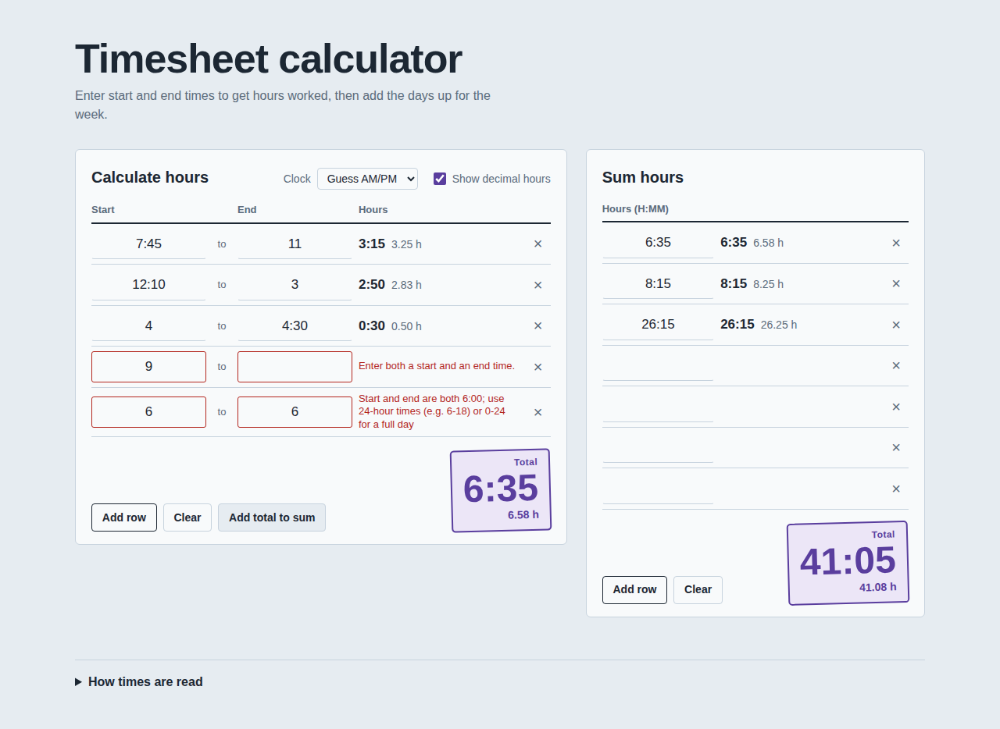
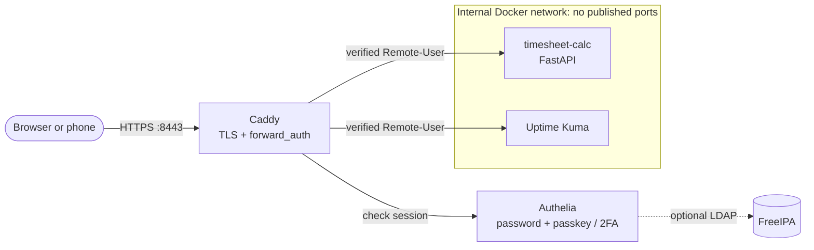

# homelab-stack

A self-hosted timesheet calculator and the Ansible deployment that puts it, and other apps, behind single sign-on on a
Synology NAS.

| Project | What it is |
|---|---|
| [`timesheet-calc/`](timesheet-calc/) | Python package: timesheet math library, CLI, and FastAPI web app. No runtime dependencies for the core. |
| [`nas-stack/`](nas-stack/) | Ansible playbook: deploys Caddy (HTTPS) and Authelia (passkeys/2FA) in front of the timesheet app and Uptime Kuma on Synology DSM. |

<picture>
  <source media="(prefers-color-scheme: dark)" srcset="timesheet-calc/docs/screenshots/desktop-dark.png">
  
</picture>

## Architecture



### Security model

- **Apps publish no ports.** They live on an internal network that only Caddy can reach.
- **Identity comes from one place.** Caddy strips any identity headers the client sends, asks Authelia, and forwards
  only the identity Authelia returns.
- **The app fails closed.** In header mode, a missing identity is a 401 and a user outside the allowlist is a 403.
  A misconfigured auth setting stops the app at startup.
- **Access is deny-by-default.** Each app has an explicit Authelia rule; two-factor is the default policy.

These properties are tested, not assumed. See [Testing](#testing).

## Quick start

**Try the app locally (no NAS needed):**

```bash
cd timesheet-calc
pip install -e ".[web]"
timesheet-web                 # http://127.0.0.1:8000
timesheet calc 7:45-11 12:10-3 4-4:30
```

**Deploy the full stack to a NAS:** follow [`nas-stack/README.md`](nas-stack/README.md#first-deployment). Summary:

1. Set the NAS address in `inventory/hosts.yml`.
2. Create and encrypt `vault.yml`.
3. Point DNS at the NAS.
4. Run `ansible-playbook site.yml`.

## Repository layout

```
homelab-stack/
├── timesheet-calc/            # Python package (library, CLI, web app)
│   ├── src/timesheet_calc/
│   │   ├── core.py            # parsing and time arithmetic: the single source of truth
│   │   ├── cli.py             # `timesheet` command
│   │   └── web/               # FastAPI app, auth, static UI
│   ├── tests/                 # core, CLI, API, and auth tests
│   └── Dockerfile
└── nas-stack/                 # Ansible deployment for Synology DSM
    ├── site.yml
    ├── inventory/             # hosts, site settings, vault template
    ├── roles/                 # preflight, compose_stack, edge, timesheet, uptime_kuma
    └── tests/                 # idempotency test, post-deploy smoke test
```

## Requirements

| For | You need |
|---|---|
| The app | Python 3.11+ |
| Deploying | Ansible 9+ on your workstation; a Synology NAS on DSM 7.2+ with Container Manager |
| Testing | `curl` and `openssl` (smoke and idempotency tests) |

The stack was built for a DS1525+ (AMD Ryzen, x86-64), but nothing in it is model-specific. It should run on any x86-64
Synology NAS with Container Manager, and the same containers run on any Docker host.

## Testing

| Suite | Command | What it proves |
|---|---|---|
| App | `cd timesheet-calc && pytest` | Time math, CLI, API, and the auth layer, including fail-closed behavior (97 tests) |
| App lint | `ruff check . && ruff format --check . && mypy src tests` | Style, formatting, and strict typing |
| Playbook lint | `cd nas-stack && ansible-lint && yamllint .` | ansible-lint's production profile |
| Idempotency | `cd nas-stack && tests/idempotency.sh` | A full deploy against a local stub, run twice; fails unless the second run changes nothing |
| Post-deploy | `cd nas-stack && tests/smoke.sh home.lan 8443` | Against the live NAS: sign-in is enforced, forged identity headers are rejected, the app port is not published |

Before the first release, the rendered configs were also checked with the real tools:
- **Authelia 4.39:** the config passed `authelia validate-config`.
- **Caddy 2.11:** the Caddyfile passed `caddy validate`.
- **Live attack test:** real Caddy, Authelia, and the app were run together, and a forged `Remote-User` header never
  reached the app.

## Status and roadmap

- [x] Timesheet library, CLI, and web app
- [x] Header-based authentication behind a proxy
- [x] Ansible deployment: Caddy, Authelia, timesheet, Uptime Kuma
- [ ] First deployment verified on physical DS1525+ hardware
- [ ] GitHub Actions CI running the test and lint suites
- [ ] Additional roles: Paperless-ngx, Home Assistant, Forgejo with a private image registry

## Acknowledgments

The web app's input rules and layout are modeled on the free
[miraclesalad.com timesheet calculator](https://www.miraclesalad.com/webtools/timesheet.php). This version keeps its
input format and makes its ambiguous cases explicit.
