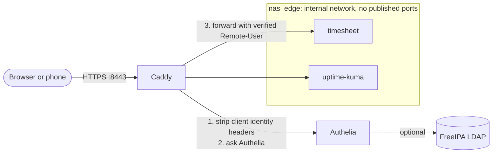

# nas-stack

Ansible deployment for a Synology NAS: **Caddy** (HTTPS) and **Authelia** (password + passkey/2FA) in front of the
[timesheet app](../timesheet-calc/) and **Uptime Kuma**. It's built for a DS1525+ on DSM 7.2+ and works on any x86-64
Synology NAS with Container Manager.

The playbook is idempotent: rerunning it with no changes reports `changed=0` and restarts nothing.



## Contents

- [What gets deployed](#what-gets-deployed)
- [Prerequisites](#prerequisites)
- [First deployment](#first-deployment)
- [First sign-in and passkeys](#first-sign-in-and-passkeys)
- [Day-to-day operations](#day-to-day-operations)
- [Adding an app](#adding-an-app)
- [Using FreeIPA accounts](#using-freeipa-accounts)
- [Configuration reference](#configuration-reference)
- [Testing](#testing)
- [Troubleshooting](#troubleshooting)

## What gets deployed

| Stack | Containers | URL | Access |
|---|---|---|---|
| `edge` | `caddy`, `authelia` | `https://auth.home.lan:8443` | Sign-in portal |
| `timesheet` | `timesheet` | `https://timesheet.home.lan:8443` | Two-factor, any user |
| `uptime-kuma` | `uptime-kuma` | `https://status.home.lan:8443` | Two-factor, `admins` group only |

Each stack is a Compose project in `/volume1/docker/<stack>/`, so Container Manager shows and manages them like any
other project.

| Role | Purpose |
|---|---|
| [`preflight`](roles/preflight/) | Validates settings, secrets, and the NAS before changing anything |
| [`compose_stack`](roles/compose_stack/) | Reusable: brings a Compose project up, rebuilds, and restarts only what changed |
| [`edge`](roles/edge/) | Caddy + Authelia: TLS, sign-in, access rules generated from `nas_apps` |
| [`timesheet`](roles/timesheet/) | Syncs the app source to the NAS and builds it there |
| [`uptime_kuma`](roles/uptime_kuma/) | Uptime monitoring and alerts |

### Security properties

- **Apps are unreachable except through Caddy.** They join `nas_edge`, an `internal` Docker network with no route to
  the LAN, and publish no ports.
- **Identity headers can't be forged.** Caddy deletes `Remote-User` and related headers from every incoming request,
  then copies back only what Authelia returns. The order is pinned with a `route` block, because Caddy's default
  directive order would run the deletion *after* Authelia and erase the real identity.
- **Access is deny-by-default.** Authelia denies any host without an explicit rule.
- **Secrets never appear in the repo or in Ansible logs.** They're encrypted with Ansible Vault, written to the NAS
  as mode-0600 files, and passed to Authelia by file path. Every task that handles them is marked `no_log`.
- **Containers are hardened.** No container can gain extra privileges, all have memory limits, and the timesheet app
  runs as a non-root user on a read-only filesystem.

## Prerequisites

| Where | What |
|---|---|
| DSM | Container Manager installed (Package Center) |
| DSM | SSH enabled: Control Panel → Terminal & SNMP → Enable SSH service |
| DSM | An account in the `administrators` group (it can `sudo` with its own password) |
| DSM | Recommended: the `docker` shared folder on an NVMe storage pool |
| Network | `auth`, `timesheet`, and `status` under your `base_domain` resolve to the NAS IP (router DNS, AdGuard Home, or hosts files) |
| Workstation | Ansible 9+ (`pip install ansible`), `ssh`, `curl`, `openssl`, and this repo with `timesheet-calc/` beside `nas-stack/` |

> [!TIP]
> For remote access, run Tailscale on the NAS and open nothing on your router. So the hostnames resolve away from
> home, enable subnet routing for your LAN and add a split-DNS entry for `base_domain` in the Tailscale admin console.

## First deployment

1. **Inventory.** In `inventory/hosts.yml`, set the NAS IP and your DSM admin username. Review
   `inventory/group_vars/nas/main.yml`, mainly `base_domain` and `nas_timezone`.

2. **Secrets.**

   ```bash
   cp inventory/group_vars/nas/vault.yml.example inventory/group_vars/nas/vault.yml
   openssl rand -hex 64      # run three times: JWT secret, session secret, storage encryption key
   ```

   Generate your password hash on any Docker host (the NAS works over SSH):

   ```bash
   sudo docker run --rm -it authelia/authelia:4.39 authelia crypto hash generate argon2
   ```

   Paste the `Digest:` value into `password_hash`, and fill in the rest of `vault.yml`.

3. **Encrypt the vault.**

   ```bash
   openssl rand -base64 32 > .vault_pass && chmod 600 .vault_pass     # git-ignored
   export ANSIBLE_VAULT_PASSWORD_FILE="$PWD/.vault_pass"              # add to your shell profile or .envrc
   ansible-vault encrypt inventory/group_vars/nas/vault.yml
   ```

   The password file is set by environment variable rather than in `ansible.cfg`, so a fresh clone can still lint
   and syntax-check before any vault exists.

4. **Test the connection, then deploy.**

   ```bash
   ansible nas -m ansible.builtin.ping
   ansible-playbook site.yml --check --diff     # optional preview; changes nothing on the NAS
   ansible-playbook site.yml
   ```

   The first run pulls images and builds the timesheet app, which takes 5 to 10 minutes.

5. **Trust the certificate.** Caddy runs its own certificate authority. The playbook saves its root certificate to
   `artifacts/nas-root-ca.crt` (git-ignored). Install it on each device as a trusted root:

   | Device | How |
   |---|---|
   | Windows | Double-click → Install Certificate → Local Machine → Trusted Root Certification Authorities |
   | macOS | Open in Keychain Access, System keychain → set to Always Trust |
   | iPhone / iPad | AirDrop or email it, install the profile, then Settings → General → About → Certificate Trust Settings → turn it on |
   | Android | Settings → Security → Encryption & credentials → Install a certificate → CA certificate |
   | Firefox | Uses its own store: Settings → Privacy & Security → Certificates → Import |

6. **Run the smoke test** to confirm authentication works on the NAS:

   ```bash
   tests/smoke.sh home.lan 8443 timesheet status
   ```

## First sign-in and passkeys

1. Open `https://timesheet.home.lan:8443`. You're redirected to the sign-in page; enter your username and password.
2. Both apps require two factors, so Authelia asks you to register one. Choose **Passkey / security key** or a
   one-time-code app.
3. Authelia sends a verification code. No email server is configured, so the code is written to a file on the NAS:

   ```bash
   ssh nasadmin@<nas-ip> sudo tail -20 /volume1/docker/edge/authelia/config/notification.txt
   ```

4. Enter the code and finish registering. From then on you can sign in with the passkey alone.

## Day-to-day operations

| Task | How |
|---|---|
| Deploy one part only | `ansible-playbook site.yml --tags timesheet` (or `edge`, `uptime_kuma`) |
| Update the timesheet app | Change code in `../timesheet-calc`, rerun; it rebuilds only when a source file changed |
| Upgrade an image | Change `edge_caddy_version`, `edge_authelia_version`, or `uptime_kuma_version` and rerun. Read Authelia's release notes before a minor-version jump |
| Add or remove a user | `ansible-vault edit inventory/group_vars/nas/vault.yml`, edit `vault_authelia_users`, rerun; Authelia restarts automatically |
| Reset a password | Generate a new hash, replace it in the vault, rerun |
| Preview changes | `ansible-playbook site.yml --check --diff` |

> [!CAUTION]
> Never change `vault_authelia_storage_encryption_key` after the first deployment. It encrypts registered passkeys
> and 2FA devices, so changing it locks every user out of their second factor. The other two secrets can be rotated;
> rotating them only signs everyone out.

## Adding an app

1. Create `roles/<app>/` using [`roles/uptime_kuma`](roles/uptime_kuma/) as the template:
   - `templates/compose.yaml.j2`: join the external `{{ nas_edge_network }}` network and publish **no** `ports:`.
   - `tasks/main.yml`: render the template, then `include_role: compose_stack`.
2. Add the app to `nas_apps` in `group_vars` with its `subdomain`, `container:port` upstream, `policy`, and
   optionally `groups`.
3. Add the role to `site.yml`, add the hostname to DNS, and run the playbook.

Caddy's site block and Authelia's access rule are both generated from `nas_apps`; there's nothing else to edit.

Apps with their own API clients (for example, Vaultwarden's mobile apps) can't complete a browser sign-in. They need
an Authelia `bypass` rule scoped to their API paths, so review those individually.

## Using FreeIPA accounts

Set `authelia_ldap_enabled: true` and fill in `authelia_ldap`:

```yaml
authelia_ldap_enabled: true
authelia_ldap:
  address: ldaps://ipa.example.com:636
  base_dn: dc=example,dc=com
  bind_user: uid=authelia,cn=sysaccounts,cn=etc,dc=example,dc=com
  ca_cert_src: "{{ playbook_dir }}/files/ipa-ca.crt"   # your IPA CA certificate (public; safe to commit)
```

Put the bind password in `vault_authelia_ldap_password`.

- Authelia uses its built-in `freeipa` directory settings and verifies the LDAPS certificate against `ca_cert_src`.
- FreeIPA group names work directly in `nas_apps[].groups`.
- The local users file is ignored while LDAP is on.

## Configuration reference

Site settings live in [`inventory/group_vars/nas/main.yml`](inventory/group_vars/nas/main.yml); secrets live in
`vault.yml` (template: [`vault.yml.example`](inventory/group_vars/nas/vault.yml.example)).

| Variable | Default | Purpose |
|---|---|---|
| `base_domain` | `home.lan` | Apps are served at `<subdomain>.<base_domain>` |
| `edge_https_port` | `8443` | Published HTTPS port. DSM itself holds 443, so the default avoids it |
| `nas_apps` | timesheet, uptime_kuma | Apps behind the edge: `name`, `subdomain`, `upstream`, `policy`, optional `groups` |
| `nas_docker_root` | `/volume1/docker` | Where each stack's folder is created |
| `nas_docker_bin`, `nas_compose_bin` | `/usr/local/bin/...` | Container Manager's binaries (sudo's PATH doesn't include them) |
| `nas_edge_network` | `nas_edge` | Name of the internal Docker network |
| `nas_timezone` | `America/New_York` | Container timezone |
| `authelia_display_name` | `Home NAS` | Name shown when registering a passkey |
| `authelia_ldap_enabled` | `false` | Sign in with FreeIPA instead of the local users file |
| `timesheet_src_dir` | `../timesheet-calc` | App source on the workstation |
| `timesheet_allowed_users` | `[]` | Optional app-level allowlist, on top of Authelia's rules |

Each role's own variables are documented in its README.

## Testing

| Test | Command | Needs |
|---|---|---|
| Lint | `ansible-lint && yamllint .` | Workstation only |
| Syntax | `ansible-playbook site.yml --syntax-check` | Workstation only |
| Idempotency | `tests/idempotency.sh` | Workstation only (Docker is stubbed out) |
| Smoke | `tests/smoke.sh home.lan 8443 timesheet status` | The deployed NAS |

**`tests/idempotency.sh`** deploys the entire playbook to the local machine with `docker` and `docker-compose`
replaced by stubs, using throwaway secrets. It runs twice and fails unless the first run deploys something and the
second changes nothing. That catches templates that re-render on every run and tasks that always report a change.
It's suitable for CI.

**`tests/smoke.sh`** needs no credentials. Against the live NAS it verifies that:
- The sign-in portal serves a certificate trusted by `artifacts/nas-root-ca.crt`.
- Every app redirects anonymous users to sign-in.
- A forged `Remote-User` header, on GET or POST, still gets redirected.
- Bad credentials are rejected.
- The app's port 8000 is not reachable directly.

It exits non-zero on any failure.

Before release, the rendered configuration was also validated with the real tools:
- **Authelia 4.39.28:** the config passed `authelia validate-config`.
- **Caddy 2.11.4:** the Caddyfile passed `caddy validate` and `caddy fmt`.
- **Live attack test:** Caddy, Authelia, and the app ran together with these configs, and forged headers never
  reached the app.

## Troubleshooting

| Symptom | Cause → fix |
|---|---|
| `python3: not found` on connect | DSM build without system Python → install Python 3 from Package Center and set `ansible_python_interpreter: /usr/local/bin/python3` |
| Preflight: Docker or Compose missing | Container Manager not installed, or different paths → `ssh <nas> 'ls /usr/local/bin/docker*'` and update `nas_docker_bin` / `nas_compose_bin` |
| `The vault password file ... was not found` | `ANSIBLE_VAULT_PASSWORD_FILE` points to a missing file → recheck step 3 |
| Browser certificate warning | Root certificate not installed on that device (step 5) |
| Redirect loop or "unable to determine cookie domain" | URL host isn't under `base_domain` (for example, you used the IP) → use the hostname |
| App shows "Your sign-in has expired" | Authelia session ended → reload the page |
| `up --wait` fails | A container is unhealthy → `sudo docker logs authelia` (or `caddy`, `timesheet`) on the NAS |
| `unknown flag: --wait` | Container Manager's Compose is too old → update Container Manager |
| Port 8443 already in use | Change `edge_https_port`, rerun, and use the new port in URLs |
